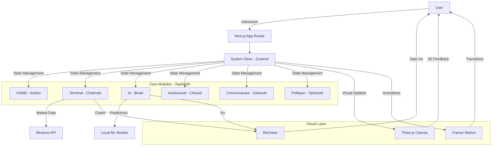

# 🌌 KBL CENTER V2 - Sovereign Digital Nexus

> **Quantum Edition** - Plateforme ésotérique moderne basée sur l'Arbre de Sephirot

[](https://nextjs.org/)
[](https://reactjs.org/)
[](https://www.typescriptlang.org/)
[](https://threejs.org/)
[](LICENSE)

## 📖 Table des Matières

- [Vue d'Ensemble](#-vue-densemble)
- [Architecture](#-architecture)
- [Installation](#-installation)
- [Structure du Projet](#-structure-du-projet)
- [Modules](#-modules)
- [Technologies](#-technologies)
- [Configuration](#%EF%B8%8F-configuration)
- [Développement](#-développement)
- [Déploiement](#-déploiement)
- [Contribution](#-contribution)

---

## 🎯 Vue d'Ensemble

**KBL CENTER V2** est une plateforme web immersive de nouvelle génération qui fusionne technologies quantiques, visualisations 3D interactives et intelligence artificielle. Inspirée par l'Arbre de Vie Kabbalistique (Sephirot), cette application offre une expérience utilisateur sans précédent.

###  Features Principales

- 🌳 **Visualisation 3D Interactive** - Arbre Sephirot en Three.js avec contrôles orbitaux
- 📜 **Whitepaper Mystique** - Documentation complète de la philosophie et architecture
- 🧠 **Intelligence Artificielle** - Modèles ML locaux (Qwen, CryptoMamba, XGBoost)
- 📊 **Terminal de Trading** - Données marché en temps réel (Binance API)
- 🏛️ **Gouvernance Décentralisée** - Système de vote et trésorerie DAO
- 👥 **Hub Communautaire** - Analytics sociaux et engagement
- 🎬 **Centre Média** - Gestion audiovisuelle avec visualiseur de fréquences
- ⚡ **Performance AAA+** - Optimisations SSR, animations 60fps, lazy loading

---

## 🏗️ Architecture



### Flux de Données

1. **User Interaction** → Actions utilisateur (clicks, scrolls, inputs)
2. **State Update** → Zustand met à jour le store global
3. **Component Re-render** → React re-rend les composants affectés
4. **Visual Feedback** → Three.js/Framer Motion anime les changements
5. **API Calls** → Fetch data externe si nécessaire

---

## 📦 Installation

### Prérequis

- **Node.js** 20.x ou supérieur
- **npm** 10.x ou **yarn** 1.22.x
- **Git** 2.x

### Installation Rapide

```bash
# 1. Cloner le repository
git clone https://github.com/SAMIRneo/kbl-center-v2.git
cd kbl-center-v2

# 2. Installer les dépendances
npm install
# ou
yarn install

# 3. Créer le fichier .env
cp .env.example .env.local

# 4. Lancer le serveur de développement
npm run dev
# ou
yarn dev
```

### Accès

Ouvrir [http://localhost:3000](http://localhost:3000) dans votre navigateur.

---

## 📁 Structure du Projet

```
kbl-center-v2/
│
├── app/                          # Next.js App Router
│   ├── (devices)/               # Routes groupées (Sephirot modules)
│   │   ├── home/               # Module Whitepaper (Kether)
│   │   ├── terminal/           # Module Trading (Chokmah)
│   │   ├── ia/                 # Module IA (Binah)
│   │   ├── audiovisuel/        # Module Média (Chesed)
│   │   ├── communautes/        # Module Social (Geburah)
│   │   └── politique/          # Module Gouvernance (Tiphereth)
│   ├── layout.tsx              # Layout racine
│   ├── page.tsx                # Page d'accueil
│   └── globals.css             # Styles globaux
│
├── components/                   # Composants réutilisables
│   ├── ui/                     # Composants UI
│   │   ├── sephirot/          # Visualisation 3D Sephirot
│   │   ├── ai/                # Composants IA
│   │   └── SystemHeader.tsx   # Header système
│   └── ...
│
├── lib/                          # Utilities & Logique métier
│   ├── store/                  # Zustand stores
│   │   └── useSystemStore.ts  # Store système global
│   ├── api/                    # API clients
│   └── utils.ts                # Fonctions utilitaires
│
├── public/                       # Assets statiques
│   ├── models/                 # Modèles 3D
│   └── images/                 # Images
│
├── .env.example                  # Variables d'environnement exemple
├── next.config.ts                # Configuration Next.js
├── tailwind.config.ts            # Configuration Tailwind
├── tsconfig.json                 # Configuration TypeScript
└── package.json                  # Dépendances projet
```

---

## 🔮 Modules

### 0. HOME - Whitepaper Sephirotique (Kether)
**Route**: `/home`

- Documentation complète de la vision et philosophie
- Architecture mystique de l'Arbre de Vie
- Visualisation 3D de géométrie sacrée (Tree of Life Core)
- 8 sections navigables : Introduction, Vision, Architecture, Technologies, Modules, Philosophie, Roadmap, Conclusion
- Navigation interactive avec sidebar et progression
- Effets visuels avancés (particules, sacred geometry, floating shapes)

### 1. Terminal de Trading (Chokmah)
**Route**: `/terminal`

- Prix BTC/USDT en temps réel (Binance API)
- Graphiques chandelier 5m
- Order Book depth visualization
- Métriques 24h (volume, variation, high/low)
- Terminal de commandes interactif
- WebSocket connections (coming soon)

### 2. Intelligence Artificielle (Binah)
**Route**: `/ia`

- Visualisation réseau de neurones (Canvas)
- Gestion modèles ML (Qwen 2.5, CryptoMamba, XGBoost)
- Flux de signaux de trading
- Backtesting & performance analytics
- GPU/VRAM monitoring

### 3. Centre Audiovisuel (Chesed)
**Route**: `/audiovisuel`

- Visualiseur de fréquences audio (Waveform)
- Médiathèque interactive
- Lecteur média avec contrôles
- Pipeline de production (Recording → Editing → Published)
- Stats de vues et engagement

### 4. Hub Communautaire (Geburah)
**Route**: `/communautes`

- Analytics d'engagement (posts, comments, likes)
- Leaderboard contributeurs
- Radar de santé communautaire
- Flux d'activité temps réel
- Statistiques de croissance

### 5. Gouvernance Politique (Tiphereth)
**Route**: `/politique`

- Système de propositions & votes
- Visualisation trésorerie (Treasury)
- Quorum & participation tracking
- Vote distribution (Pour/Contre)
- Historique des décisions

---

## 🛠️ Technologies

### Frontend Core

| Technology | Version | Usage |
|-----------|---------|-------|
| **Next.js** | 16.0.7 | Framework React SSR/SSG |
| **React** | 19.2.0 | Library UI |
| **TypeScript** | 5.x | Type safety |
| **Tailwind CSS** | 4.1.17 | Styling utility-first |

### Visualisation & Animation

| Technology | Version | Usage |
|-----------|---------|-------|
| **Three.js** | 0.170.0 | Rendu 3D WebGL |
| **@react-three/fiber** | 9.0.0 | React renderer pour Three.js |
| **@react-three/drei** | 10.7.7 | Helpers Three.js |
| **Framer Motion** | 12.23.25 | Animations déclaratives |
| **Recharts** | 3.5.1 | Graphiques data viz |

### State Management & Data

| Technology | Version | Usage |
|-----------|---------|-------|
| **Zustand** | 4.4.0 | State management global |
| **Axios** | 1.13.2 | HTTP client |
| **D3.js** | 7.9.0 | Data manipulation |

### UI Components

- **Radix UI** - Primitives accessibles
- **Lucide React** - Iconographie
- **CVA** - Class Variance Authority

---

## ⚙️ Configuration

### Variables d'Environnement

Créer un fichier `.env.local` à la racine :

```env
# API Keys
NEXT_PUBLIC_BINANCE_API_URL=https://api.binance.com
NEXT_PUBLIC_BINANCE_WS_URL=wss://stream.binance.com:9443

# Feature Flags
NEXT_PUBLIC_ENABLE_AI_MODULE=true
NEXT_PUBLIC_ENABLE_TRADING=true

# Analytics (optionnel)
NEXT_PUBLIC_GA_ID=G-XXXXXXXXXX
```

### Customisation

#### Couleurs Tailwind

Modifier `tailwind.config.ts` :

```typescript
module.exports = {
  theme: {
    extend: {
      colors: {
        primary: '#3b82f6',
        secondary: '#8b5cf6',
        // ...
      }
    }
  }
}
```

#### Animations Framer

Ajuster les variants dans `lib/animations.ts`.

---

## 💻 Développement

### Scripts Disponibles

```bash
# Développement avec hot-reload
npm run dev

# Build production
npm run build

# Lancer build production localement
npm start

# Linter
npm run lint

# Type checking
npx tsc --noEmit
```

### Best Practices

1. **Composants** - Privilégier les composants fonctionnels avec hooks
2. **Types** - Typer toutes les props et states (strict mode)
3. **Performance** - Utiliser `React.memo`, `useMemo`, `useCallback`
4. **Accessibilité** - Respecter WCAG 2.1 AA
5. **SEO** - Metadata dans chaque page

### Debugging

```bash
# React DevTools
# Installer l'extension Chrome/Firefox

# Zustand DevTools
# Activer dans le store:
import { devtools } from 'zustand/middleware'
const useStore = create(devtools(...))
```

---

## 🚀 Déploiement

### Vercel (Recommandé)

```bash
# Installer Vercel CLI
npm i -g vercel

# Déployer
vercel

# Production
vercel --prod
```

### Docker

```dockerfile
# Dockerfile
FROM node:20-alpine
WORKDIR /app
COPY package*.json ./
RUN npm ci
COPY . .
RUN npm run build
EXPOSE 3000
CMD ["npm", "start"]
```

```bash
docker build -t kbl-center-v2 .
docker run -p 3000:3000 kbl-center-v2
```

---

## 🤝 Contribution

### Workflow

1. Fork le repository
2. Créer une branche feature (`git checkout -b feature/amazing-feature`)
3. Commit les changes (`git commit -m 'Add amazing feature'`)
4. Push vers la branche (`git push origin feature/amazing-feature`)
5. Ouvrir une Pull Request

### Conventions

- **Commits** : Conventional Commits (`feat:`, `fix:`, `docs:`, etc.)
- **Branches** : `feature/`, `bugfix/`, `hotfix/`, `docs/`
- **Code Style** : ESLint + Prettier (config incluse)

---

## 📄 License

Ce projet est sous licence **MIT**. Voir le fichier [LICENSE](LICENSE) pour plus de détails.

---

## 🙏 Remerciements

- **Three.js Community** - Pour les ressources 3D
- **Vercel** - Pour l'hébergement Next.js
- **Binance** - Pour l'API market data

---

## 📞 Contact

**SAMIRneo** - [@SAMIRneo](https://github.com/SAMIRneo)

Project Link: [https://github.com/SAMIRneo/kbl-center-v2](https://github.com/SAMIRneo/kbl-center-v2)

---

<div align="center">
  <strong>Built with 💜 by SAMIRneo</strong>
  <br>
  <em>Sovereign Digital Nexus - Quantum Edition</em>
</div>
